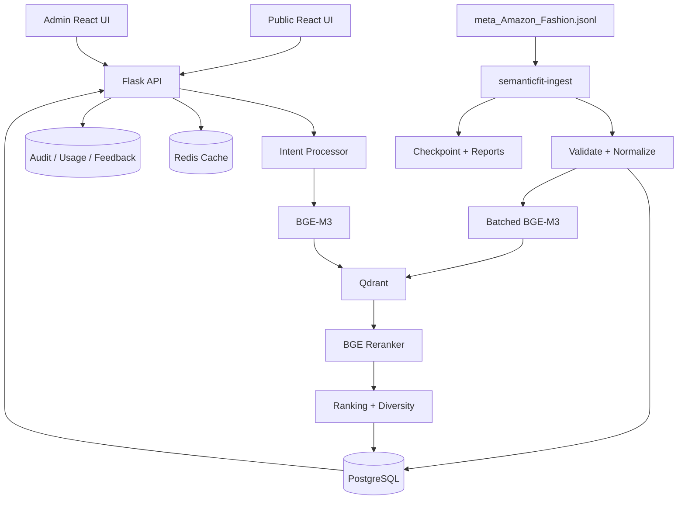

# SemanticFit

**Meaning-first fashion discovery with hybrid semantic retrieval, reranking, evaluation, auditability, and an optional feedback loop.**

SemanticFit is an open-source reference implementation of a modern product recommendation microservice. It turns natural-language shopping requests such as **“I need something lightweight for a summer beach vacation under $100”** into ranked fashion recommendations without requiring an LLM to perform retrieval.

The default catalog source is the McAuley Lab **Amazon Reviews 2023** metadata file:

- Dataset home: https://huggingface.co/datasets/McAuley-Lab/Amazon-Reviews-2023
- Catalog file: `meta_Amazon_Fashion.jsonl`
- Expected raw file size: about 1.42 GB
- Canonical product identifier: `parent_asin`

> SemanticFit uses the raw JSONL metadata file directly. It does not require `datasets.load_dataset()` or remote dataset loader code.

## Why SemanticFit

Traditional catalog search works well when a user knows the exact keyword. SemanticFit is designed for intent-oriented queries involving occasion, climate, style, material, rating, and budget.

```text
Natural-language query
        ↓
Intent processing
        ↓
BGE-M3 dense + sparse representations
        ↓
Qdrant hybrid retrieval + RRF
        ↓
BGE reranker
        ↓
Quality + popularity + intent ranking
        ↓
Category-aware diversification
        ↓
Top recommendations
```

The LLM layer is optional. When disabled, the complete semantic search pipeline remains available.

---

## Features

### Public experience

- Natural-language fashion search
- Dense + sparse hybrid retrieval
- Hard price/rating/category filters
- Cross-encoder reranking
- Rating confidence and popularity ranking
- Category-aware result diversification
- Product images, ratings, price, metadata, and details
- “Why this fits” explanations
- Responsive React UI
- Light and dark themes
- Optional thumbs-up / not-relevant feedback
- No user login required for search

### Dataset ingestion

- Streams the 1.42 GB JSONL file line by line
- Does not load the full catalog into RAM
- Validation and normalization
- Batched BGE-M3 embeddings
- PostgreSQL batch upserts
- Qdrant batched vector upserts
- Byte-offset checkpoints
- Crash / Ctrl-C resume
- Deterministic product and vector IDs
- Malformed-record quarantine file
- Throughput, progress, ETA, and quality counters
- Ingestion report JSON
- Index verification and rebuild commands

### Evaluation

- Dedicated `semanticfit-eval` CLI
- Evaluation dataset validation
- Intent coverage
- Constraint satisfaction
- Proxy precision for weakly labeled starter cases
- Standard Precision@K, Recall@K, MRR, and NDCG when manual product IDs are supplied
- Diversity
- Mean/P50/P95/P99 latency
- Historical evaluation runs in PostgreSQL
- JSON, CSV, Markdown, and HTML reports
- Regression comparison
- Concurrent API benchmark tool

### Administration

- Fixed development account: `admin / admin123`
- Search usage analytics
- Audit log
- CSV/JSON audit export
- Feedback analytics
- Evaluation reports
- Ingestion history and live progress
- Qdrant/PostgreSQL alignment information
- Runtime model/configuration overview

**The default admin credentials are for local development only. SemanticFit refuses them when `APP_ENV=production`.**

---

## Architecture



More detail is available in [`docs/architecture.md`](docs/architecture.md).

---

## Technology stack

| Layer | Technology |
|---|---|
| Frontend | React 18, TypeScript, Vite |
| Data fetching | TanStack Query |
| Charts | Recharts |
| Icons | Lucide |
| Backend | Python 3.11+, Flask, Gunicorn |
| ORM | SQLAlchemy / Flask-SQLAlchemy |
| Canonical product DB | PostgreSQL |
| Vector DB | Qdrant |
| Cache | Redis, optional |
| Embedding | `BAAI/bge-m3` via FlagEmbedding |
| Reranker | `BAAI/bge-reranker-v2-m3` |
| CLI | Typer + Rich |
| Containers | Docker Compose |

---

# Quick start with Docker

## 1. Clone and configure

```bash
git clone <your-semanticfit-repository-url>
cd semanticfit
cp .env.example .env
```

The default `.env` is development-oriented. Before any public deployment, change at least:

```env
APP_SECRET_KEY=<long-random-secret>
ADMIN_USERNAME=<new-admin-name>
ADMIN_PASSWORD=<strong-password>
SESSION_COOKIE_SECURE=true
APP_ENV=production
```

## 2. Start infrastructure and application

```bash
docker compose up -d --build
```

Services:

| Service | URL |
|---|---|
| Web UI | http://localhost:3000 |
| Flask API | http://localhost:5000 |
| Qdrant | http://localhost:6333 |
| Prometheus metrics | http://localhost:5000/metrics |
| Admin UI | http://localhost:3000/admin |

Development admin:

```text
username: admin
password: admin123
```

## 3. Put the dataset in the mounted data folder

Download `meta_Amazon_Fashion.jsonl` from the Amazon Reviews 2023 dataset repository and place it here:

```text
data/raw/meta_Amazon_Fashion.jsonl
```

SemanticFit also supports `.jsonl.gz` input. Plain `.jsonl` provides the most useful byte-based progress percentage and fastest resume behavior.

## 4. Inspect before ingestion

```bash
docker compose exec backend \
  semanticfit-ingest inspect \
  /workspace/data/raw/meta_Amazon_Fashion.jsonl
```

This samples the file and reports:

- estimated line count
- invalid record rate in the sample
- missing-field warnings
- top categories
- top stores
- price distribution summary
- rating distribution summary
- file fingerprint

## 5. Validate the file

Validate the entire file without writing anything:

```bash
docker compose exec backend \
  semanticfit-ingest validate \
  /workspace/data/raw/meta_Amazon_Fashion.jsonl
```

Bounded validation:

```bash
docker compose exec backend \
  semanticfit-ingest validate \
  /workspace/data/raw/meta_Amazon_Fashion.jsonl \
  --limit 100000
```

Strict mode treats soft warnings as invalid for validation purposes:

```bash
docker compose exec backend \
  semanticfit-ingest validate \
  /workspace/data/raw/meta_Amazon_Fashion.jsonl \
  --strict
```

## 6. Run full ingestion

```bash
docker compose exec backend \
  semanticfit-ingest ingest \
  /workspace/data/raw/meta_Amazon_Fashion.jsonl \
  --batch-size 128 \
  --checkpoint-every 1000
```

The terminal shows live status similar to:

```text
Status             running
Processed          340500
Success            337912
Failed             2588
Progress Percent   44.7
Rate Per Second    386.2
ETA Seconds        2701
Current Line       340500
```

Each committed checkpoint records the file offset, line number, counts, throughput, ETA, warnings, and top categories.

### GPU ingestion

With NVIDIA Container Toolkit installed:

```bash
docker compose -f docker-compose.yml -f docker-compose.gpu.yml up -d --build
```

Recommended GPU settings:

```env
EMBEDDING_DEVICE=cuda
EMBEDDING_USE_FP16=true
EMBEDDING_BATCH_SIZE=256
```

Tune batch size for your VRAM. Do not assume the largest batch is fastest.

### Apple Silicon / local MPS

For a non-Docker local Python installation:

```env
EMBEDDING_DEVICE=mps
EMBEDDING_USE_FP16=false
```

---

# Resume interrupted ingestion

List recent jobs:

```bash
docker compose exec backend semanticfit-ingest status
```

Resume a specific job:

```bash
docker compose exec backend \
  semanticfit-ingest resume <JOB_ID> \
  --batch-size 128
```

Resume safety rules:

1. The dataset fingerprint must match the original job.
2. Resume starts from the last fully committed checkpoint.
3. PostgreSQL upserts are idempotent by `parent_asin`.
4. Qdrant point IDs are deterministic UUIDs derived from `parent_asin`.
5. A partially failed batch is intentionally safe to replay.

Malformed rows are appended to:

```text
data/errors/ingestion_<JOB_ID>.jsonl
```

A final ingestion report is written to:

```text
reports/ingestion/<JOB_ID>.json
```

---

# Verify PostgreSQL and Qdrant

```bash
docker compose exec backend semanticfit-ingest verify
```

The command compares:

- PostgreSQL product rows
- rows marked `indexed=true`
- Qdrant point count

If an index needs rebuilding without re-reading the source file:

```bash
docker compose exec backend \
  semanticfit-ingest rebuild-index \
  --batch-size 128
```

---

# Dataset structure understood by SemanticFit

A raw metadata record is normalized from fields such as:

```json
{
  "main_category": "AMAZON FASHION",
  "title": "Example product",
  "average_rating": 4.5,
  "rating_number": 120,
  "features": ["Feature one"],
  "description": ["Description text"],
  "price": 29.99,
  "images": [
    {
      "thumb": "https://...",
      "large": "https://...",
      "variant": "MAIN",
      "hi_res": "https://..."
    }
  ],
  "videos": [],
  "store": "Store name",
  "categories": ["Women", "Clothing", "Tops"],
  "details": {"Fabric type": "Cotton"},
  "parent_asin": "B012345678",
  "bought_together": null
}
```

Important ingestion decisions:

- `parent_asin` is the canonical SemanticFit product ID.
- Missing price stays `NULL`. It is never converted to zero.
- `store` is preserved as store, not silently treated as brand.
- `details` remains JSONB because its keys vary widely.
- `features`, `description`, and `categories` remain arrays.
- image objects remain intact, while `primary_image` and `thumbnail_image` are derived for UI speed.
- a controlled search document is built from title, category, features, description, and selected semantic details.
- technical identifiers and raw URLs are not inserted into the embedding text.

---

# Search document

SemanticFit converts a product into a stable search representation:

```text
Title: Women's Linen Button Down Shirt
Category: Women > Clothing > Tops
Features: Lightweight breathable fabric. Relaxed fit.
Description: Casual long sleeve summer shirt.
Attributes: Fabric type: 70% Cotton, 30% Linen.
Store: Example
```

That text is encoded by BGE-M3. Structured values such as price and rating are retained as filters/ranking signals instead of being trusted to vector similarity.

---

# Search pipeline

## 1. Intent processing

The default deterministic intent parser extracts common:

- occasion
- season
- weather
- style
- material
- color
- maximum/minimum price
- minimum rating
- exclusions

Unknown constraints are not invented.

## 2. Optional LLM intent parsing

The semantic engine does **not** require an LLM. Enable one only if complex natural-language parsing is useful:

```env
LLM_ENABLED=true
LLM_PROVIDER=openai
LLM_API_KEY=...
LLM_MODEL=...
```

Supported adapters:

- `openai`
- `openai_compatible`
- `gemini`
- `anthropic` / `claude`
- `ollama`

The LLM is asked only for structured query intent. If it fails, SemanticFit automatically falls back to deterministic parsing and direct BGE-M3 retrieval.

## 3. Hybrid retrieval

BGE-M3 returns:

- dense vector
- sparse lexical weights

Qdrant searches the `dense` and `sparse` named vectors and fuses them using Reciprocal Rank Fusion.

## 4. Hard filtering

Qdrant applies structured constraints such as:

- price range
- minimum rating
- category
- store

## 5. Reranking

The top candidates are reranked with `BAAI/bge-reranker-v2-m3`.

## 6. Final ranking

The default scoring combines:

```text
55% reranker relevance
20% normalized hybrid retrieval score
10% Bayesian rating confidence
 5% logarithmic popularity
10% intent/category alignment
```

These are starting weights, not universal truth. Use evaluation and feedback to tune them.

## 7. Diversification

The Amazon metadata file is already parent-ASIN-centric. SemanticFit therefore does not pretend it has child color/size records that need variant deduplication. Instead, it enforces unique `parent_asin` records during ingestion and applies leaf-category repetition penalties when selecting the final results.

---

# Public API

## Health

```bash
curl http://localhost:5000/api/v1/health
```

## Readiness

Readiness checks the local model stack and Qdrant. The first call may trigger model loading/download:

```bash
curl http://localhost:5000/api/v1/ready
```

## Recommendations

```bash
curl -X POST http://localhost:5000/api/v1/recommendations \
  -H 'Content-Type: application/json' \
  -d '{
    "query": "I need a black formal dress for a summer wedding under $120",
    "limit": 8,
    "filters": {
      "min_rating": 4.0
    }
  }'
```

Example response shape:

```json
{
  "request_id": "req_...",
  "query": "...",
  "intent": {
    "occasion": ["wedding"],
    "season": ["summer"],
    "style": ["formal"],
    "colors": ["black"],
    "max_price": 120
  },
  "results": [
    {
      "product_id": "...",
      "title": "...",
      "price": 84.99,
      "rating": 4.6,
      "match_percent": 91,
      "reason": "...",
      "score_breakdown": {
        "reranker": 0.96,
        "semantic": 0.82,
        "quality": 0.91,
        "popularity": 0.68,
        "intent_alignment": 1.0
      }
    }
  ],
  "meta": {
    "retrieved": 50,
    "reranked": 20,
    "returned": 8,
    "latency_ms": 94.2,
    "cache_hit": false,
    "llm_used": false
  }
}
```

Debug timing:

```text
POST /api/v1/recommendations?debug=true
```

## Product

```bash
curl http://localhost:5000/api/v1/products/<PARENT_ASIN>
```

## Feedback

```bash
curl -X POST http://localhost:5000/api/v1/feedback \
  -H 'Content-Type: application/json' \
  -d '{
    "request_id": "req_...",
    "product_id": "B012345678",
    "feedback_type": "helpful"
  }'
```

---

# Evaluation

The starter evaluation dataset is:

```text
evaluation/datasets/core.jsonl
```

It contains weak intent labels, not fabricated product relevance IDs. SemanticFit therefore reports **proxy precision** and **intent coverage** for these cases instead of misrepresenting them as gold-standard relevance judgments.

Run:

```bash
docker compose exec backend \
  semanticfit-eval run \
  --dataset /workspace/evaluation/datasets/core.jsonl \
  --k 10
```

Reports are stored under:

```text
reports/evaluation/YYYYMMDD_HHMMSS/
├── summary.json
├── cases.csv
├── report.md
└── report.html
```

## Add manually labeled relevance

For real Precision@K, Recall@K, MRR, and NDCG, add reviewed `parent_asin` labels:

```json
{
  "id": "gold_001",
  "query": "linen shirt for a beach holiday",
  "relevant_parent_asins": ["B0...", "B0..."],
  "expected_terms": ["linen", "beach"],
  "constraints": {}
}
```

SemanticFit automatically enables standard retrieval metrics for cases containing `relevant_parent_asins`.

## Compare runs

```bash
semanticfit-eval compare <RUN_A> <RUN_B>
```

## Fail on regression

```bash
semanticfit-eval run \
  --dataset ../evaluation/datasets/core.jsonl \
  --fail-on-regression
```

The initial regression guard fails when the primary quality score drops by more than two percentage points. Replace this with project-specific CI thresholds as the evaluation set matures.

## Load benchmark

```bash
semanticfit-eval benchmark \
  --url http://localhost:5000 \
  --concurrency 25 \
  --requests-count 200
```

Reports mean, P50, P95, P99, and error count.

---

# Feedback loop

Feedback is optional:

```env
FEEDBACK_ENABLED=true
```

V1 stores signals but **does not automatically change live ranking weights**. This is deliberate.

Signals include:

- product helpful
- product not relevant
- search helpful / partial / not helpful
- product click
- detail view

Recommended improvement loop:

```text
Negative feedback
      ↓
Admin review
      ↓
Create / update evaluation case
      ↓
Run offline evaluation
      ↓
Tune ranking or model
      ↓
Regression test
      ↓
Deploy
```

This avoids unstable self-training from noisy online feedback.

---

# Audit log

Important events include:

- `ADMIN_LOGIN`
- `ADMIN_LOGOUT`
- `SEARCH_REQUEST`
- `INGESTION_STARTED`
- `INGESTION_PAUSED`
- `INGESTION_COMPLETED`
- `INGESTION_FAILED`
- `INDEX_REBUILT`

Raw IP addresses are not stored by default. Request IPs are salted and hashed for audit correlation.

Admin exports:

```text
/api/v1/admin/audit/export?format=csv
/api/v1/admin/audit/export?format=json
```

---

# Manual local development

## Infrastructure only

```bash
docker compose up -d postgres qdrant redis
```

## Python backend

```bash
python3.12 -m venv .venv
source .venv/bin/activate
pip install --upgrade pip
pip install -e './backend[ml,dev]'

cp .env.example .env
# For host-based backend, keep localhost DB/Qdrant/Redis URLs in .env.

semanticfit-bootstrap
cd backend
flask --app wsgi:app run --debug --port 5000
```

## React frontend

```bash
cd frontend
npm install
npm run dev
```

Vite proxies `/api` to `http://localhost:5000`.

---

# Low-resource smoke mode

BGE-M3 and the reranker are real ML models and require meaningful memory. For unit tests or architecture smoke testing only:

```env
EMBEDDING_BACKEND=hash
EMBEDDING_DIM=128
RERANKER_ENABLED=false
```

The hash backend is deterministic and supports both dense-like and sparse vectors. It is **not** intended as a quality substitute for BGE-M3.

If switching an already-created Qdrant collection between the hash backend and BGE-M3, reset/rebuild the collection because vector dimensions differ.

---

# Tests

Backend:

```bash
cd backend
pip install -e '.[dev]'
pytest -q
```

Frontend:

```bash
cd frontend
npm install
npm run build
```

All:

```bash
make test
```

---

# Performance guidance

## Keep model workers under control

Gunicorn defaults to one process with multiple threads:

```env
GUNICORN_WORKERS=1
GUNICORN_THREADS=8
```

This is intentional because multiple Python processes duplicate large embedding/reranking models in RAM/VRAM. For larger deployments, split model inference into its own service or size workers to available memory.

## Batch ingestion

Start with:

```env
EMBEDDING_BATCH_SIZE=128
```

Benchmark 64, 128, 256, and larger values on your actual GPU.

## Qdrant

SemanticFit uses:

- cosine dense vector index
- sparse vector index
- HNSW dense search
- payload indexes for price, rating, category, and store
- RRF fusion

For catalogs larger than the Fashion subset, tune HNSW, on-disk payload/vector options, and quantization based on measured recall and latency.

## PostgreSQL

PostgreSQL is the canonical product and reporting database. Qdrant is a rebuildable search index. Ingestion uses PostgreSQL `ON CONFLICT` batch upserts when connected to PostgreSQL.

## Redis

Redis caches search responses. If Redis fails, search continues without caching.

---

# Security notes

For production:

1. Never use `admin / admin123`.
2. Set a strong `APP_SECRET_KEY`.
3. Run behind HTTPS.
4. Set `SESSION_COOKIE_SECURE=true`.
5. Restrict `CORS_ORIGINS`.
6. Keep PostgreSQL, Qdrant, and Redis on private networks.
7. Add reverse-proxy rate limits and authentication if admin is internet-facing.
8. Rotate LLM/API credentials using a secret manager.
9. Do not expose Qdrant's administrative API publicly.
10. Review data licensing and Amazon dataset terms before any commercial use.

SemanticFit never executes source dataset content as code. The ingestion path uses streaming JSON parsing only.

---

# Repository layout

```text
semanticfit/
├── backend/
│   ├── app/
│   │   ├── api/
│   │   ├── services/
│   │   ├── models.py
│   │   ├── audit.py
│   │   └── config.py
│   ├── ingestion/
│   ├── evaluation/
│   ├── tests/
│   ├── Dockerfile
│   └── pyproject.toml
├── frontend/
│   ├── src/
│   │   ├── components/
│   │   ├── pages/
│   │   └── lib/
│   ├── Dockerfile
│   └── nginx.conf
├── evaluation/
│   └── datasets/core.jsonl
├── data/
│   ├── raw/
│   └── errors/
├── reports/
├── docs/
├── docker-compose.yml
├── docker-compose.gpu.yml
├── Makefile
└── README.md
```

---

# Design decisions and trade-offs

## Qdrant instead of FAISS

FAISS is excellent for local similarity indexing. SemanticFit uses Qdrant because the enhanced GitHub project also needs persistent named dense/sparse vectors, metadata filtering, hybrid fusion, operational APIs, and an independently rebuildable search service.

## PostgreSQL plus Qdrant

Qdrant is intentionally not the only product database. PostgreSQL remains canonical so index changes cannot destroy product/reporting state.

## Local embeddings by default

BGE-M3 makes the project reproducible without a paid embedding API and supports semantic plus lexical representations from one model family.

## Rerank only candidates

Cross-encoder reranking is more expensive than vector retrieval, so it runs only on the candidate set.

## LLM optional

LLMs help with complex intent parsing, but making one mandatory increases cost, latency, and operational dependency. SemanticFit degrades gracefully when the LLM is disabled or unavailable.

## Feedback is offline first

Live user feedback is noisy. SemanticFit stores feedback for analysis/evaluation instead of immediately changing ranking.

## No full review dataset in V1

`meta_Amazon_Fashion.jsonl` is enough for the semantic catalog engine. The separate Amazon Fashion review file can later support collaborative recommendation, sentiment, review-aware ranking, and personalization through the shared `parent_asin` relationship.

---

# Roadmap

- Review-aware ranking using `Amazon_Fashion.jsonl`
- Collaborative filtering
- Multimodal text + product image embeddings
- Outfit composition mode
- Bought-together graph expansion
- Learning-to-rank from curated feedback
- Admin conversion of negative feedback into evaluation cases
- Prometheus/Grafana dashboard templates
- Alembic migration workflow for long-lived deployments
- Dedicated GPU model inference service
- A/B test framework

---

## License

Apache License 2.0. See [`LICENSE`](LICENSE).
