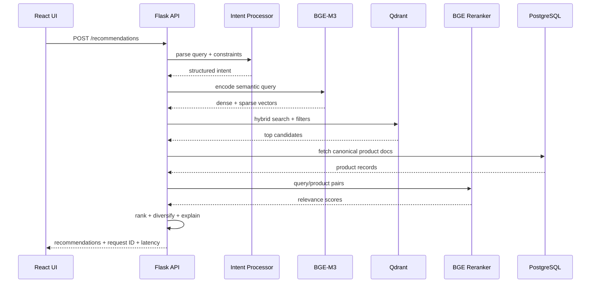

# SemanticFit Architecture

## Online recommendation path

## Storage responsibilities

### PostgreSQL

Canonical product metadata, ingestion jobs/checkpoints, search usage, audit history, feedback, and evaluation runs.

### Qdrant

Rebuildable search index containing named `dense` and `sparse` representations plus compact filter payloads.

### Redis

Optional response cache. Redis failure is non-fatal.

## Model lifecycle

Embedding and reranking models are lazy singletons in the Flask process. The default Gunicorn topology uses one worker process to avoid duplicating model memory. Threads handle concurrent request work around shared models and network/storage operations.
