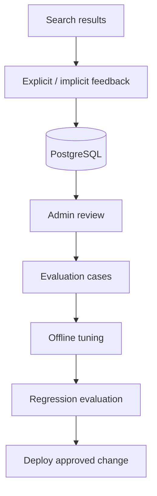

# Feedback Loop

Feedback storage is optional and does not alter online ranking automatically.

Recommended uses include hard-negative mining, ranking-weight tuning, reranker fine-tuning, and creation of regression cases.
