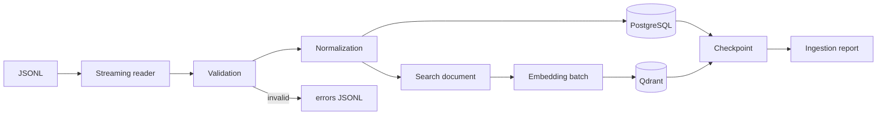

# Ingestion Pipeline

The ingestion application is intentionally independent of the web UI. It can process the full `meta_Amazon_Fashion.jsonl` catalog as a streaming job.

A checkpoint advances only after the batch is safely written to PostgreSQL and Qdrant. A crash before checkpoint advancement causes that small batch window to replay on resume. Both data paths are idempotent.

`parent_asin` is the catalog identity. The raw metadata file is parent-product oriented, so SemanticFit enforces identity uniqueness rather than inventing child variant deduplication.
